<div align="center">

# HR Insight AI

**Predictive workforce analytics that tells HR *who* is likely to leave, *why*, and *what it costs to keep them*.**

A full-stack platform combining a trained XGBoost attrition model, an LLM report writer, and a role-scoped web app.

[](https://nextjs.org)
[](https://nestjs.com)
[](https://fastapi.tiangolo.com)
[](https://xgboost.ai)
[](https://neon.tech)
[](#testing)

</div>

---

## The problem

Three things make workforce attrition expensive and hard to manage:

| Problem | Cost |
|---|---|
| **Reports are built by hand.** HR pulls from multiple tools, cleans spreadsheets, builds slides. | 10–20 hours/week of senior time |
| **There is no early warning.** You learn someone is leaving when they resign. | Replacing an employee costs **1.5×–2× their salary** |
| **Reports describe, they don't prescribe.** Averages and trends, no decisions. | Analysis that changes nothing |

**HR Insight AI** turns that into one flow: pick a team → the model scores every employee → an LLM writes the executive summary and a costed action plan → export a PDF. Seconds, not hours.

---

## Demo

### Report generation — the core flow

Pick a team and a date range. A WebSocket streams progress through six stages while the backend fetches employees, calls the ML service, and drafts the narrative. The finished report carries a risk score, an executive summary, a ranked action plan with cost and timeline per item, and an interactive ROI model.

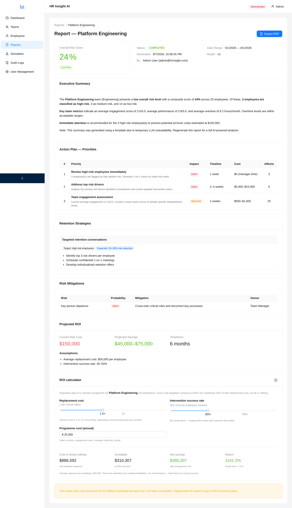

### Simulation — "what would actually move the number?"

The lever that makes the model useful rather than just interesting. Adjust engagement, overtime, pay, promotion cadence, or training, and the team is re-scored live against the same XGBoost model. Nothing is written to the database — it is a pure what-if.

Below: raising engagement by 1 point and cutting 6 hours of weekly overtime drops team risk **41% → 14%**, moving 7 people out of the HIGH-risk bucket.

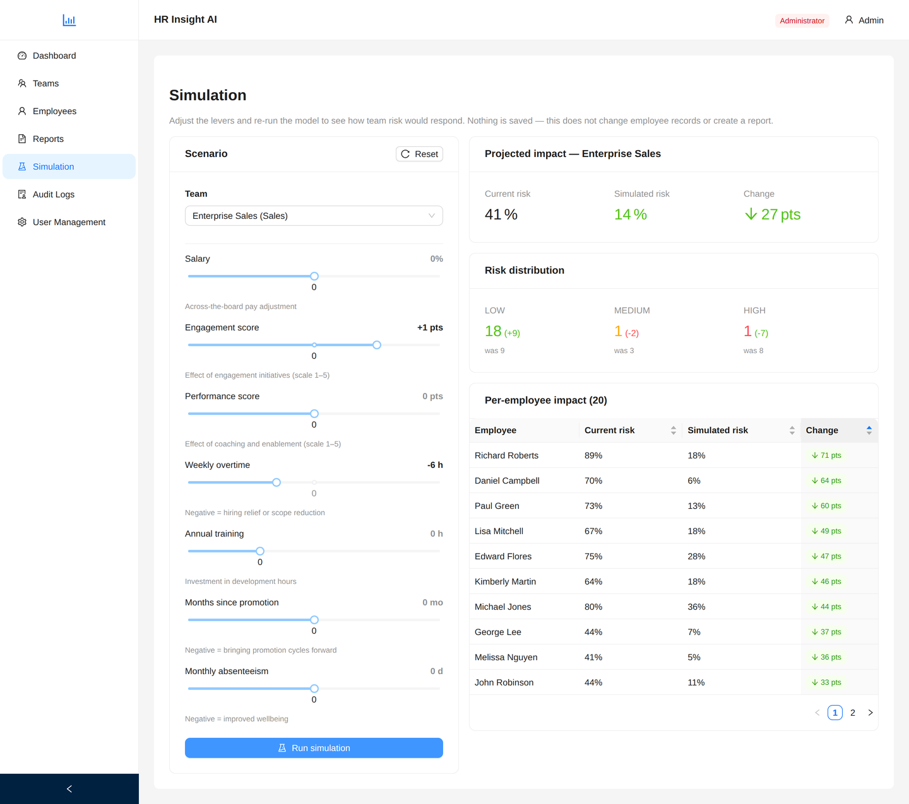

### Dashboard — where risk is concentrated

Per-team analytics plus a heatmap normalised across every team the signed-in user can see, so the worst cell is always the one to act on. Colour is relative to peers, not to an arbitrary fixed threshold.

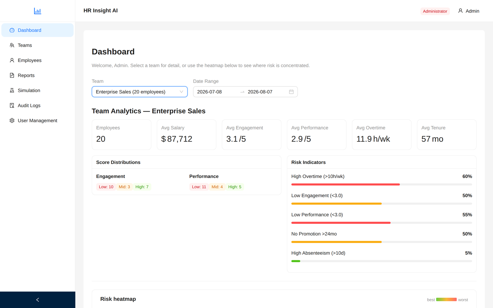

<details>
<summary><b>More screens</b> — employees, teams, user management, audit log, API docs, mobile</summary>

<br>

**Employees** — cross-team list, searchable and sortable, colour-coded on engagement and performance.

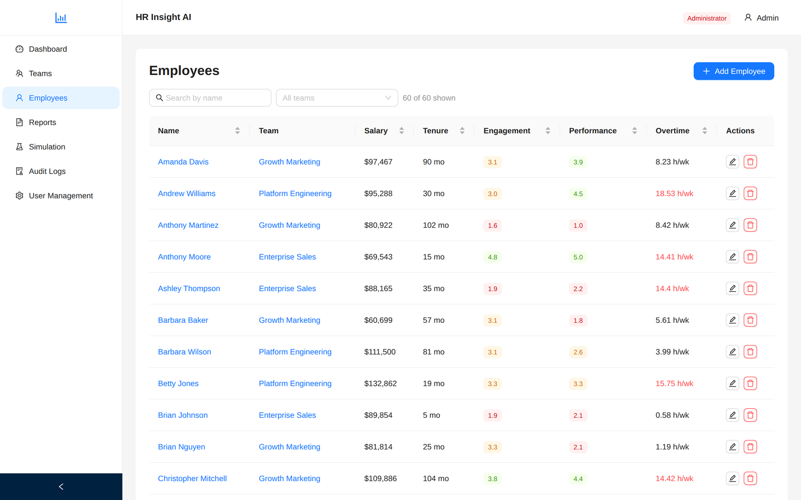

**User management** (Admin only) — assign roles and scope Team Managers to specific teams. A manager with no assignments sees no data.

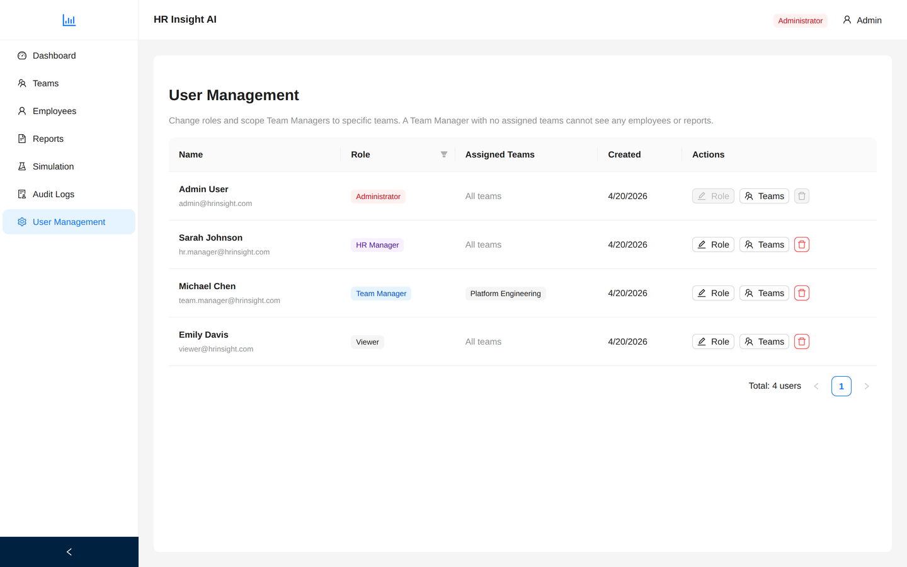

**Audit log** — every mutating action recorded with actor, entity, and IP. Filterable by action and entity type.

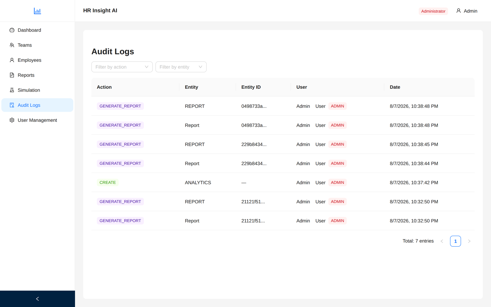

**Reports list** — history per team with risk tags, scoped to what your role may see.

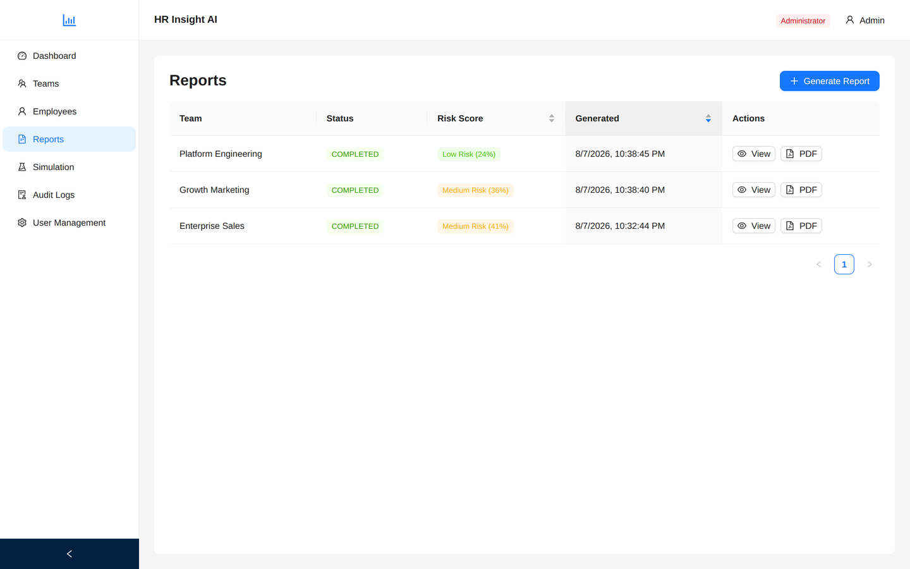

**Teams**

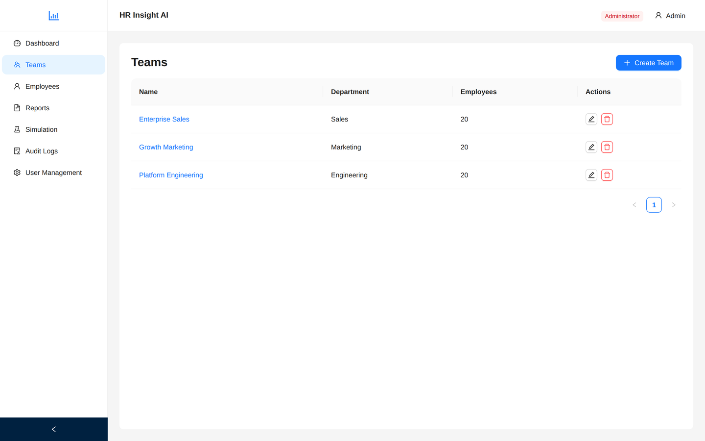

**Interactive API docs** — generated from the code at `/api/docs`.

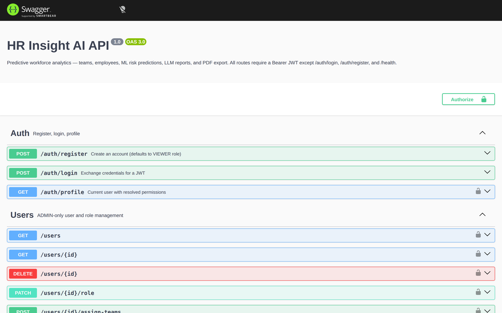

**Mobile** — the layout collapses rather than scrolling sideways.

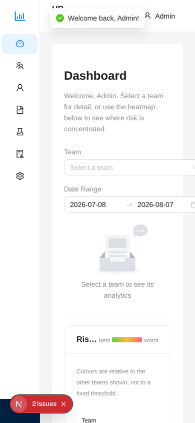

**Login**

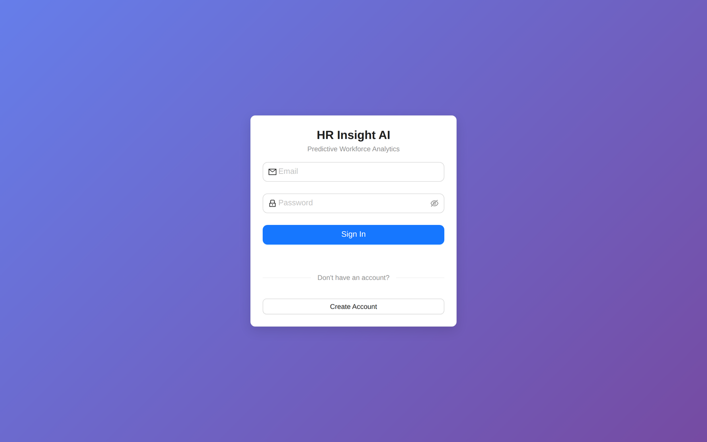

</details>

---

## How it works

```
                        ┌──────────────────────────────────────┐
   Browser              │  Next.js 16 · App Router · Ant Design│
   :3002                │  socket.io-client for live progress  │
                        └───────────────┬──────────────────────┘
                            REST + WebSocket (JWT)
                        ┌───────────────▼──────────────────────┐
   API                  │  NestJS 11                           │
   :3010                │  JWT auth · 4-role RBAC · audit log  │
                        │  report orchestration · PDF export   │
                        └──┬─────────────┬──────────────┬──────┘
                           │             │              │
              ┌────────────▼───┐  ┌──────▼──────┐  ┌────▼──────────┐
   ML         │ FastAPI        │  │ Claude API  │  │ PostgreSQL    │
   :8000      │ XGBoost + ETL  │  │ (Anthropic) │  │ Neon · Prisma │
              │ X-API-Key auth │  │ summary +   │  │ 8 tables      │
              │ 12 features    │  │ action plan │  │               │
              └────────────────┘  └─────────────┘  └───────────────┘
```

**The report pipeline**, end to end:

1. **Authorize** — verify the caller may generate for this team (Team Managers are scoped by assignment)
2. **Fetch** the team's employees from Postgres
3. **Predict** — POST 8 raw metrics per employee to the ML service, which engineers 4 derived features, scales them with the fitted `StandardScaler`, and returns a probability plus per-employee risk drivers
4. **Aggregate** into team averages and a risk distribution
5. **Write** — Claude drafts the executive summary, then a JSON-schema-constrained action plan
6. **Persist** — report, action plan, and one risk snapshot per employee (so risk is trackable over time)
7. **Audit** and emit `report:complete` over the WebSocket

Progress is pushed at each stage, so the UI shows real state rather than a spinner.

### Design decisions worth calling out

- **The ML service never sees names or IDs.** The backend sends only the 8 numeric metrics. There is nothing to leak in the prediction request.
- **Risk is probability-weighted, not bucketed.** The ROI model multiplies each salary by that employee's actual probability, so someone at 55% contributes 55% of a replacement cost. Bucketing to LOW/MEDIUM/HIGH would throw that away.
- **The LLM is optional.** If the Anthropic API is down, rate-limited, or unconfigured, report generation still completes using template fallbacks, and the report is labelled as template-generated so nobody is misled. `/health/ready` reports the degraded state.
- **RBAC is enforced in the query, not the response.** A Team Manager's Prisma `where` clause carries their assignment filter, so out-of-scope rows are never fetched — not fetched-then-filtered.
- **Heatmap colour is relative.** Salary bands and overtime norms differ enormously between organisations, so a fixed threshold would paint everything the same shade.

---

## Roles

Four roles, enforced on the server and reflected in the UI.

| Role | Teams | Reports | Generate | Simulate | Users | Audit log |
|---|---|---|---|---|---|---|
| **Admin** | all | all | ✅ | ✅ | ✅ | ✅ |
| **HR Manager** | all | all | ✅ | ✅ | — | ✅ |
| **Team Manager** | assigned only | assigned only | ✅ | ✅ | — | — |
| **Viewer** | all | own only | — | — | — | — |

---

## Tech stack

| Layer | Choices |
|---|---|
| **Frontend** | Next.js 16 (App Router), TypeScript, Ant Design 6, `@ant-design/charts`, socket.io-client, react-markdown |
| **Backend** | NestJS 11, Prisma 7, Passport JWT, socket.io, pdfmake, Anthropic SDK, helmet, `@nestjs/throttler`, Swagger |
| **ML service** | FastAPI, XGBoost 3.2, scikit-learn 1.8, pandas 3.0, joblib |
| **Database** | Neon PostgreSQL — 8 tables, 4 enums |
| **Testing** | Jest (backend), Vitest + Testing Library (frontend), pytest (ML service) |

---

## Quickstart

**Prerequisites:** Node 20+, Python 3.11+, a Neon (or any) PostgreSQL database, and an [Anthropic API key](https://console.anthropic.com/settings/keys).

```bash
git clone <your-repo-url> hr-insight-ai
cd hr-insight-ai
```

**1. Configure environments** — copy each example and fill in the blanks:

```bash
cp backend/.env.example      backend/.env
cp ai-service/.env.example   ai-service/.env
cp frontend/.env.example     frontend/.env.local
```

Two values must match each other, or predictions fail with a 403:

```bash
# generate one shared secret
node -e "console.log(require('crypto').randomBytes(32).toString('hex'))"
# paste the same value into AI_SERVICE_API_KEY in BOTH backend/.env and ai-service/.env
```

**2. Install:**

```bash
npm install                                    # root: concurrently
cd ai-service && python -m venv venv && cd ..   # create the Python venv
npm run install:all                            # backend, frontend, ai-service deps
```

**3. Migrate and seed** — creates 4 users, 3 teams, 60 employees:

```bash
npm run seed
```

**4. Run all three services:**

```bash
npm run dev
```

Open **http://localhost:3002** and sign in:

| Email | Role | Password |
|---|---|---|
| `admin@hrinsight.com` | Admin | `Password123!` |
| `hr.manager@hrinsight.com` | HR Manager | `Password123!` |
| `team.manager@hrinsight.com` | Team Manager (Platform Engineering only) | `Password123!` |
| `viewer@hrinsight.com` | Viewer | `Password123!` |

**5. Verify the stack is healthy:**

```bash
curl -s localhost:3010/health/ready | python3 -m json.tool
```

```json
{
  "status": "up",
  "components": {
    "database":  { "status": "up", "latencyMs": 41 },
    "aiService": { "status": "up", "latencyMs": 16, "detail": "model v1" },
    "llm":       { "status": "up", "detail": "API key configured" }
  }
}
```

`degraded` returns 200 (the app works, minus ML or LLM); `down` returns 503.

---

## Testing

```bash
npm test              # all three suites
npm run test:backend  # Jest
npm run test:frontend # Vitest
npm run test:ai       # pytest
npm run smoke         # end-to-end HTTP checks against a running stack
```

**185 tests.** The coverage is deliberately weighted toward the parts where a bug is expensive:

| Suite | Tests | Focus |
|---|---:|---|
| `backend` | 116 | RBAC scoping (a bug here leaks another team's salary data), the 6-step report pipeline, LLM fallback behaviour, Prisma-error → HTTP-status mapping, health aggregation |
| `ai-service` | 69 | Every cleaning rule, feature-engineering edge cases (zero denominators), model contract and determinism, API-key enforcement on destructive endpoints |
| `frontend` | — | Vitest + Testing Library configured; component tests in progress |

The ML tests skip cleanly when model artifacts are absent, so a fresh clone still gets a green run.

---

## The ML model

Trained on 5,000 synthetic HR records generated by `ai-service/scripts/generate_training_data.py`.

**8 raw features** — salary, tenure, engagement, performance, absenteeism, overtime, months since promotion, training hours.

**4 engineered features** — `salary_per_tenure`, `engagement_performance`, `overtime_absenteeism`, `promotion_overdue`. Each is IQR-capped, because ratios explode on edge inputs (a one-month employee's salary-per-tenure would otherwise dominate after scaling).

**Current metrics** (`app/artifacts/training_metadata.json`):

| Metric | Value |
|---|---|
| AUC-ROC | 0.729 |
| Accuracy | 0.723 |
| Recall | 0.577 |
| Precision | 0.431 |
| CV AUC-ROC | 0.704 ± 0.005 |

> **Honest note:** the project's own acceptance criterion was AUC-ROC > 0.80, and the model is at **0.729**. The ceiling here is the *synthetic* training data, not the pipeline — the generator produces a weaker attrition signal than real HR data carries. Improving this means a better data generator or a real dataset (e.g. IBM HR Attrition), not more hyperparameter tuning. It is listed as open work below rather than quietly presented as a pass.

**Top drivers by gain:** engagement (0.160), overtime hours (0.110), promotion overdue (0.079), salary (0.078).

Retrain end to end:

```bash
curl -X POST localhost:8000/model/retrain -H "X-API-Key: $AI_SERVICE_ADMIN_KEY"
```

---

## Security

- **JWT** with role claims; a global guard means routes are protected by default and opt out explicitly with `@Public()`
- **Rate limiting** — 200 req/min baseline, and `/auth/login` tightened to 10/min so it is not brute-forceable
- **`helmet`** security headers; CORS restricted to an explicit origin allowlist
- **The ML service refuses to start without an API key** rather than silently running open. `/etl/run` and `/model/retrain` overwrite model artifacts on disk, so they take a separate admin key. Comparison is `hmac.compare_digest`.
- **A global exception filter** maps Prisma errors to real HTTP statuses (`P2002` → 409, `P2025` → 404) so driver internals and column names never reach the client
- **Audit interceptor** logs every POST/PATCH/DELETE with actor, entity, and IP
- **Secrets** live only in `.env` files, which are gitignored; every service ships a documented `.env.example`

---

## Project layout

```
hr-insight-ai/
├── backend/                     NestJS API
│   ├── src/
│   │   ├── auth/                JWT strategy, guards, @Roles/@Public decorators
│   │   ├── users/               Admin user + role + team-assignment management
│   │   ├── teams/ employees/    RBAC-scoped CRUD
│   │   ├── analytics/           Team metrics · simulation · heatmap · comparison
│   │   ├── reports/             Orchestration · WebSocket gateway · PDF · AI client
│   │   ├── llm/                 Claude integration with template fallbacks
│   │   ├── risk-snapshots/      Per-employee risk history
│   │   ├── audit/               Interceptor + queryable log
│   │   ├── health/              Liveness + deep readiness probes
│   │   └── common/filters/      Global exception filter
│   └── prisma/                  Schema (8 models, 4 enums) + seed
│
├── frontend/                    Next.js app
│   └── src/
│       ├── app/(auth)/          Login · register
│       ├── app/(dashboard)/     Dashboard · teams · employees · reports ·
│       │                        simulation · users · audit logs
│       ├── components/          Heatmap · comparison · ROI calculator · charts
│       ├── contexts/            AuthProvider
│       ├── hooks/               useReportProgress (WebSocket)
│       └── lib/                 api · ws · roi · errors · constants
│
├── ai-service/                  FastAPI ML service
│   ├── app/
│   │   ├── etl/                 extract · clean · transform · validate · pipeline
│   │   ├── models/              train (XGBoost) · predict
│   │   ├── routes/              /health · /predict · /etl · /model/retrain
│   │   ├── security.py          X-API-Key auth, two privilege tiers
│   │   └── artifacts/           model · scaler · feature names · metadata
│   ├── notebooks/               EDA · ETL · model experiments
│   └── tests/                   pytest suite (+ legacy scripts under manual/)
│
├── docs/                        Architecture notes, progress tracker, screenshots
└── scripts/smoke-test.sh        End-to-end HTTP checks
```

---

## Status & open work

**Working end to end:** auth and RBAC, all CRUD, the ETL pipeline, model training and serving, report generation with live progress, PDF export, simulation, heatmap, team comparison, ROI modelling, audit trail, and health probes.

**Open:**

- [ ] **Model quality** — AUC-ROC 0.729 vs. the 0.80 target; needs a stronger data generator or a real dataset
- [ ] Frontend component tests (runner is configured, tests not yet written)
- [ ] Smoke test currently covers the Admin path only; per-role passes would catch scoping regressions faster
- [ ] Internal talent-mobility feature ("Hidden Talent Finder") — matching employees to open roles by inferred skill overlap. Needs new schema and a second model.

---

## License

UNLICENSED — portfolio project.
